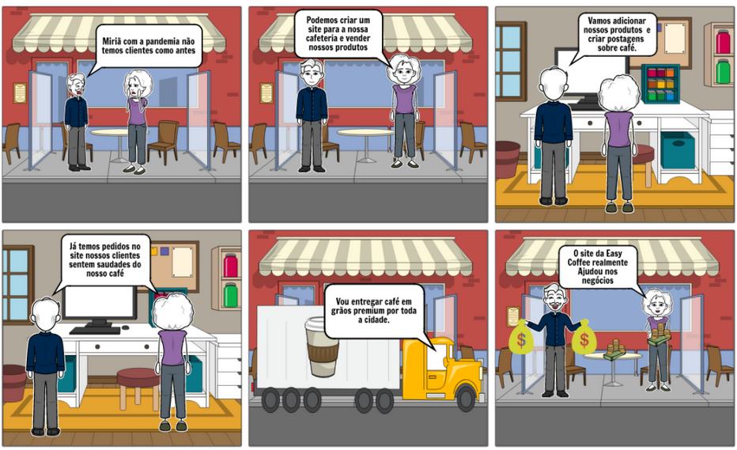
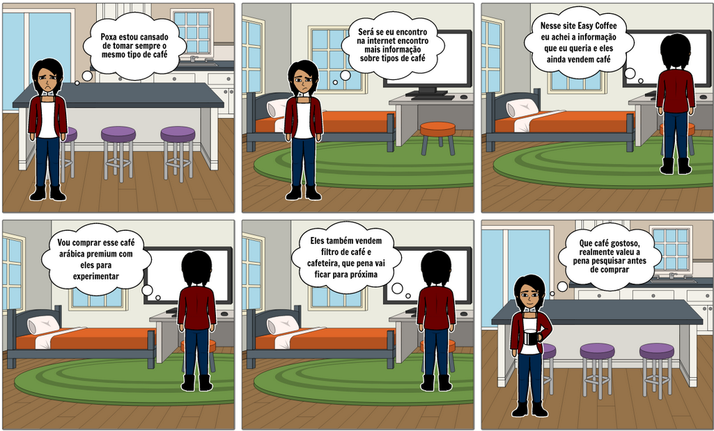

# Storyboard

Storyboard é um organizador gráfico, utilizado como uma especie de roteiro desenhado para auxiliar a indetificação de requisitos, muito parecido com uma história em quadrinho.

Durante uma reunião de grupo no meets, foi feito a Desing Sprint. Durante a etapa de Decision da Desing Sprint foi utilizado a ferramenta [Storyboard That](https://www.storyboardthat.com) foi criado dois storyboards, sendo o primério sobre o vendedor e o segundo sobre o cliente.

## Storyboard Vendedor

## Storyboard Cliente

## Referência Bibliográficas
 - STORYBOARD. In: WIKIPÉDIA: a enciclopédia livre. Wikimedia, 2021. Disponível em: https://pt.wikipedia.org/wiki/Storyboard. Acesso em: 13 fev. 2021.

## Versionamento

| Data | Versão | Descrição | Autor(es) |
|------|------|------|------|
|15/02/2021|1.0|Adicionando storyboards|[Danilo Domingo](https://github.com/danilow200), [Gabrielle Ribeiro](https://github.com/Gabrielle-Ribeiro), [Gustavo Afonso](https://github.com/GustavoAPS), [Iago Theóphilo](https://github.com/IagoTheophilo), [Itallo Gravina](https://github.com/itallogravina), [Maicon Mares](https://github.com/MaiconMares), [Rafael Ribeiro](https://github.com/rafaelflarrn)|