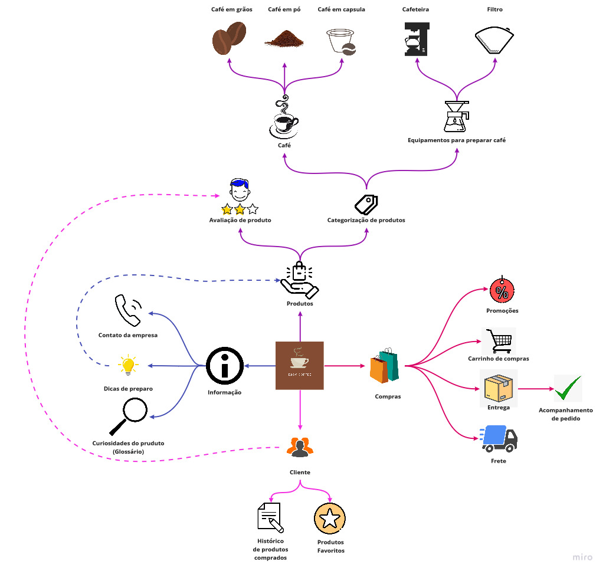

# Mapa Mental

Mapa mental é um tipo de diagrama, que é utilizado como uma técnica de memorização. Ele tem como objetivo associar ideias e pensamento não lineares, utilizado para mostrar de formar visual quais são os principais requisitos do projeto.

O mapa mental foi elaborado a partir dos dados levantados no Brainstorming durante a primeira etapa da Desing Sprint, chamada Unpack. Foi utilizada nessa etapa para documentar a Brainstorming.

## Mapa Mental - V1.0

## Referência Bibliográficas

- Guia de Criatividade, 46 - Mapas Mentais. Disponível em: https://sites.google.com/site/guiadecriatividade/46---mapas-mentais. Acesso em: 15 fev. 2021.
- MAPA METAL. In: WIKIPÉDIA: a enciclopédia livre. Wikimedia, 2021. Disponível em:https://pt.wikipedia.org/wiki/Mapa_mental. Acesso em: 15 fev. 2021.

## Versionamento

| Data | Versão | Descrição | Autor(es) |
|------|------|------|------|
|15/02/2021|1.0|Adicionando mapa mental|[Danilo Domingo](https://github.com/danilow200), [Gabrielle Ribeiro](https://github.com/Gabrielle-Ribeiro), [Gustavo Afonso](https://github.com/GustavoAPS), [Iago Theóphilo](https://github.com/IagoTheophilo), [Itallo Gravina](https://github.com/itallogravina), [Maicon Mares](https://github.com/MaiconMares), [Rafael Ribeiro](https://github.com/rafaelflarrn)|