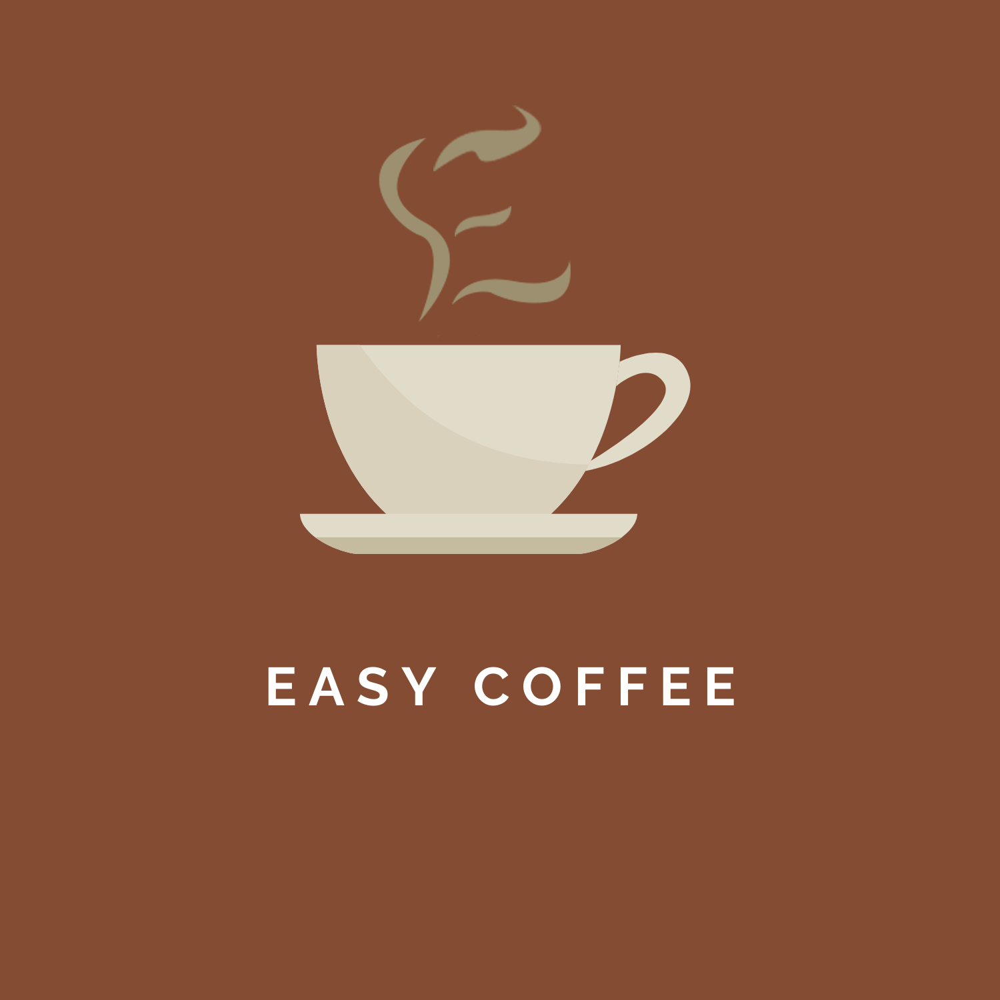
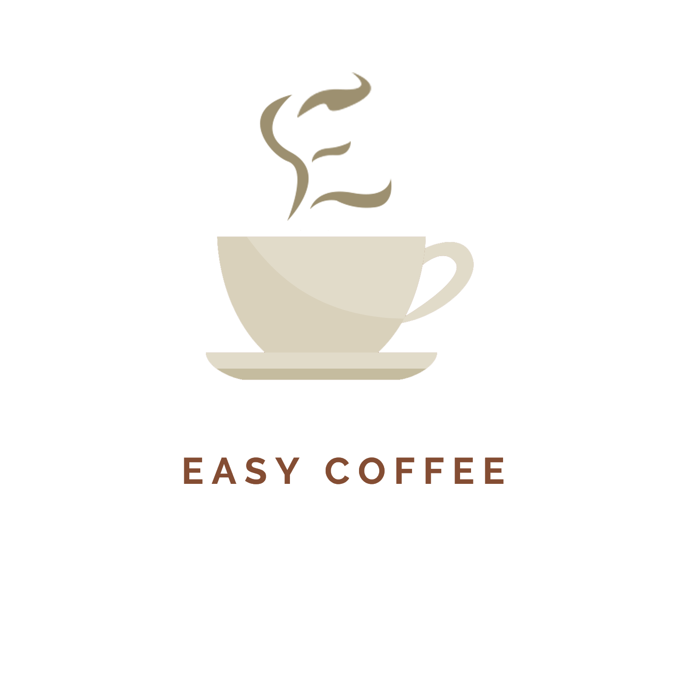
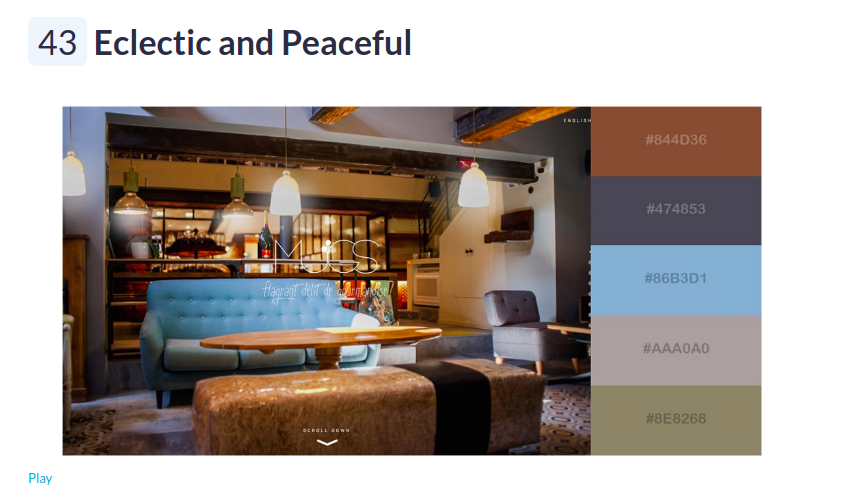
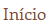
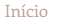

# Guia de Estilo

Este guia de estilo tem como função registrar as decisões de design relacionadas a implementação do projeto Easy Coffee. O guia de estilo serve como uma ferramenta para comunicação entre a equipe de design e a equipe de desenvolvimento.

## 1. Logo

Foi elaborado duas logos para o projeto, sendo uma delas com fundo e a outra sem, uma vez visto que isso facilitará o uso da mesma.

### 1.1. Logo com fundo

Autores: [Danilo Domingo](https://github.com/danilow200) e [Gustavo Afonso](https://github.com/GustavoAPS)

### 1.2. Logo sem fundo

Autores: [Danilo Domingo](https://github.com/danilow200) e [Gustavo Afonso](https://github.com/GustavoAPS)

## 2. Nome da aplicação

Foi escolhido o nome Easy Coffee, devido a facilidade que é ter o seu proprio café entregue em casa, sem a necessidade de ter que ir em uma loja para adiquirilo, assim remetendo a algo fácil. Então foi escolhido a palavra easy que do inglês é facíl e coffee que também do inglês é café.

## 3. Paleta de Cores

Para paleta de cores foi escolhido cinco cores como basé, sendo um marrom que remete a cor do café, duas tonilades de azul e duas tonilidades de cinza que interagem muito bem com o marrom.
A imagem a seguir mostra a paleta de cores e demonstra como as cores conversam entre si.

Devido ao nome escolhido, a logo foi elaborada para ser uma xícara de café com um vapor em formato da letra "E" para lembrar do nome Easy Coffee.

## 4. Tipografia

As fontes utilizada na aplicação serão:

- **Clarendon LT**(Linotype) para títulos
- **Sacramento**(Open Font License) para títulos
- **Enriqueta**(Open Font License) para textos

## 5. Botões
Os botões utilizados no menu de navegação possuem fundos transparentes e utilizam do marrom que se encontra na palheta de cores em sua fonte, ficando mais claros quando o mouse é passado por cima.

 

Os demais botões utilizados possuem o fundo marrom e a fonte branca.

## Referência Bibliográficas
- MANUAL DE INDENTIDADE VISUAL, UNIJUI. Disponível em: https://www.unijui.edu.br/arquivos/manual_identidade/manual_completo.pdf. Acesso em: 15 fev 2021.

## Versionamento

| Data | Versão | Descrição | Autor(es) |
|------|------|------|------|
|15/02/2021|1.0|Criando a primeira versão do Guia de Estilo|[Danilo Domingo](https://github.com/danilow200)|