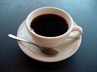
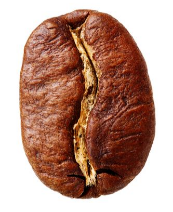
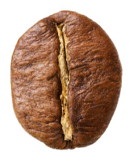
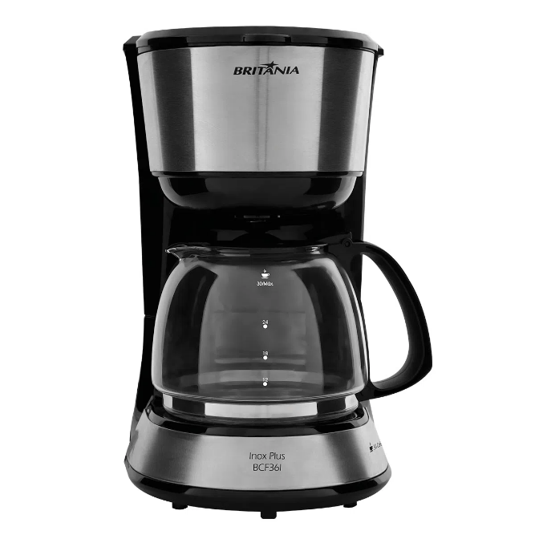
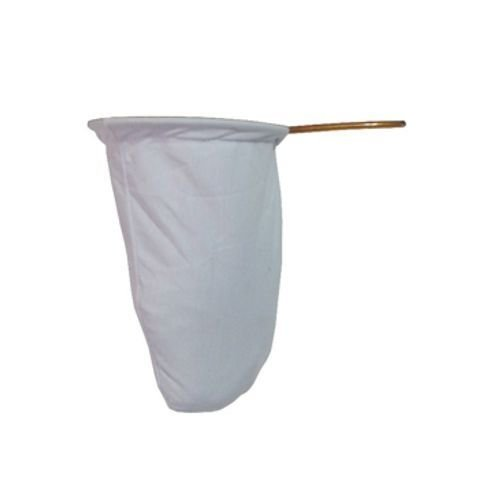
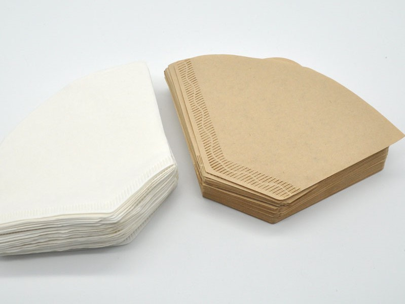
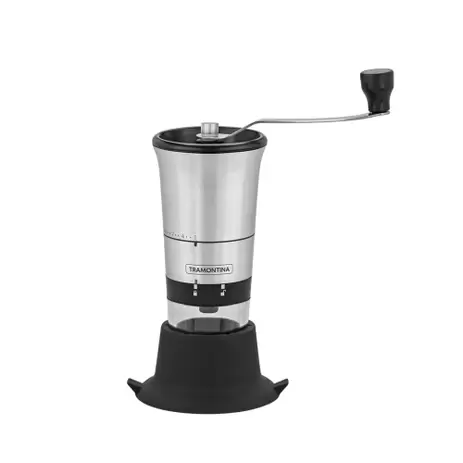

# Léxicos

O léxico é uma técnica que tem por objetivo trazer uma descrição dos símbolos de uma linguagem, utilizando a notação LAL (Léxico Ampliado da Linguagem). Com essa técnica é possível identificar palavras, frases e termos específicos utilizados dentro do domínio da aplicação.

Esses símbolos são apresentados em ordem alfabética. Cada um deles trará uma noção, que diz respeito ao significado desse símbolo, e um impacto, que traz uma descrição do efeito desse símbolo na aplicação ou o efeito de algo na aplicação sobre o símbolo. Além disso, cada um contará com os respectivos sinônimos e com a classificação que pode ser: Objeto, Verbo, Sujeito ou Estado.

Alguns dos símbolos apresentados também contam com uma imagem representativa, para auxiliar na sua compreensão.

## Símbolos

### Blend

| **Símbolo**   | Blend |
|---------------|---------|
| **Sinônimos** | - |
| **Classificação** | Objeto |
| **Noção** | Expressão originária da língua inglesa. Traduzindo “blend” para o português temos “combinação” ou “mistura”. Significa uma mistura planejada que é composta por grãos de espécies, sabores e/ou torras diferentes, com o objetivo de criar uma bebida com um sabor desejado específico. |
| **Impacto** | Um blend de [café](#Café) pode ser [cadastrado](#Cadastro) pelo [proprietário](#Proprietário) para [venda](#Venda).   Um blend pode ser [comprado](#Compra) por um [cliente](#Cliente). |

### Cadastro

| **Símbolo**   | Cadastro |
|---------------|---------|
| **Sinônimos** | Cadastrar. |
| **Classificação** | Verbo |
| **Noção** | Ato em que o [proprietário](#Proprietário) registra alguma informação no sistema, como por exemplo, produtos. |
| **Impacto** | Os produtos podem ser cadastrados pelo [proprietário](#Proprietário).   O [cliente](#Cliente) pode [comprar](#Compra) um produto cadastrado. |

### Café

| **Símbolo**   | Café |
|---------------|---------|
| **Sinônimos** | Café em grãos, café em pó, café em cápsulas. |
| **Classificação** | Objeto |
| **Noção** | É uma bebida feita a partir da infusão de água quente com grãos de café torrados e moídos.   Pode se referir também ao pó de café, café em grãos, café em cápsulas, ou café em outras formas que são utilizadas para o preparo da bebida.|
| **Impacto** | Pode ser [cadastrado](#Cadastro) café em grãos, em pó ou em cápsulas pelo [proprietário](#Proprietário) para [venda](#Venda)   Pode ser  [comprado](#Compra) café em grãos, em pó ou em cápsulas pelo [cliente](#Cliente).   Pode ser [comprado](#Compra) pelo [cliente](#Cliente) uma [cafeteira](#Cafeteira) para fazer [café](#Café). |

<i>Imagem de uma xícara com café </i>  Disponível em: https://upload.wikimedia.org/wikipedia/commons/thumb/4/45/A_small_cup_of_coffee.JPG/200px-A_small_cup_of_coffee.JPG

### Café Arábica 

| **Símbolo**   | Café Arábica |
|---------------|---------|
| **Sinônimos** | Coffea arabica. |
| **Classificação** | Objeto |
| **Noção** |Espécie de [café](#Café) originária da Arábia e Etiópia. É utilizado na produção de [cafés](#Café) de qualidade superior. Muitos dos [cafés](#Café) finos produzidos do mundo são feitos a partir de variações dessa espécie. Seus grãos são cultivados em altitudes de mais de 1000 metros, pois a grande altitude está relacionada com a maior qualidade do grão. Essa espécie possui um teor mais baixo de [cafeína](#Cafeína), porém um teor mais elevado de açúcar. |
| **Impacto** | O [café](#Café) [vendido](#Venda) pelo [proprietário](#Proprietário) pode ser café arábica.   Pode ser comprado pelo [cliente](#Cliente).   Pode ser [cadastrado](#Cadastro) pelo [proprietário](#Proprietário).|

<i> Imagem de grão de café arábica </i>  Disponível em: https://img.itdg.com.br/tdg/images/blog/uploads/2019/04/graos-robusta-e-arabica.jpg

### Café Robusta 

| **Símbolo**   | Café Robusta |
|---------------|---------|
| **Sinônimos** | Coffea canephor, Café Conilon. |
| **Classificação** | Objeto |
| **Noção** | Espécie de [café](#Café) cultivada em diversos países como o Brasil e o Vietnã. Esse tipo de [café](#Café) tem facilidade de se desenvolver em regiões de clima quente e úmido, além de poder ser cultivado em regiões com altitudes mais baixas de até 600 metros. Essa espécie é de fácil plantio, pois é mais resistente ao ataque de pragas. Esse tipo de grão tem uma concentração mais alta de [cafeína](#Cafeína), o que torna o sabor do [café](#Café) mais amargo e sua consistência mais encorpada. |
| **Impacto** | O [café](#Café) [vendido](#Venda) pelo [proprietário](#Proprietário) pode ser café robusta.   Pode ser comprado pelo [cliente](#Cliente).   Pode ser [cadastrado](#Cadastro) pelo [proprietário](#Proprietário). |

<i> Imagem de grão de café robusta </i>  Disponível em: https://img.itdg.com.br/tdg/images/blog/uploads/2019/04/graos-robusta-e-arabica.jpg

### Cafeína

| **Símbolo**   | Cafeína |
|---------------|---------|
| **Sinônimos** | - |
| **Classificação** | Objeto |
| **Noção** | É um composto químico, presente em determinadas plantas como nos grãos de [café](#Café). É utilizado como estimulante, sendo consumido em forma de bebidas preparadas por meio de infusão. |
| **Impacto** | O [café](#Café) [vendido](#Venda) pelo [proprietário](#Proprietário) possui cafeína ou pode ser [descafeinado](#Descafeinado).|

### Cafeteira

| **Símbolo**   | Cafeteira |
|---------------|---------|
| **Sinônimos** | - |
| **Classificação** | Objeto |
| **Noção** | Utensílio culinário utilizado para preparar [cafés](#Café).  |
| **Impacto** | Pode ser [cadastrado](#Cadastro) pelo [proprietário](#Proprietário).   Pode ser comprado pelo [cliente](#Cliente). |

<i>Imagem de uma cafeteira </i>  Disponível em: http://philco.vteximg.com.br/arquivos/ids/169071/CAFETEIRA-INOX-PLUS-BCF36I_063901102_1.jpg?v=636765905077070000

### Cliente

| **Símbolo**   | Cliente |
|---------------|---------|
| **Sinônimos** | Comprador, Usuário. |
| **Classificação** | Sujeito |
| **Noção** | Pessoa que realizará [compras](#Compra) de [café](#Café) e produtos relacionados. |
| **Impacto** | Cliente pode efetuar compra de produtos, como [café](#Café), [cafeteiras](#Cafeteira) etc.   Cliente pode acompanhar status de uma [compras](#Compra).   Cliente pode adicionar um produto como favorito.   Cliente pode verificar histórico de [compras](#Compra) anteriores. |

### Coador

| **Símbolo**   | Coador |
|---------------|---------|
| **Sinônimos** | - |
| **Classificação** | Objeto |
| **Noção** | Utensílio culinário feito de pano, utilizado como filtro para separar a parte líquida da parte sólida do [café](#Café). |
| **Impacto** | Pode ser [cadastrado](#Cadastro) pelo [proprietário](#Proprietário) para [venda](#Venda).   Pode ser [comprado](#Compra) pelo [cliente](#Cliente).|

<i>Imagem de um coador</i> Disponível em: http://d26lpennugtm8s.cloudfront.net/stores/522/745/products/coador-de-cafe-de-pano-grande-com-aro-e-cabo-de-arame-480-coisasdecasanet1-2337beaef6fa85953d15411137417485-640-0.jpg

### Compra

| **Símbolo**   | Compra |
|---------------|---------|
| **Sinônimos** | Comprar. |
| **Classificação** | Verbo |
| **Noção** | Ato em que o [cliente](#Cliente) adquire um produto. |
| **Impacto** | Os produtos como [café](#Café), [cafeteiras](#Cafeteira), [coadores](#Coador) etc podem ser comprados pelo [cliente](#Cliente). |

### Descafeinado

| **Símbolo**   | Descafeinado |
|---------------|---------|
| **Sinônimos** | Café descafeinado. |
| **Classificação** | Objeto |
| **Noção** | [Café](#Café) que em sua composição foi retirado cerca de 97% da [cafeína](#Cafeína) presente. |
| **Impacto** | Pode ser [cadastrado](#Cadastro) para [venda](#Venda) pelo [proprietário](#Proprietário)   Pode ser [comprado](#Compra) pelo [cliente](#Cliente). |

### Filtro de café

| **Símbolo**   | Filtro de café |
|---------------|---------|
| **Sinônimos** | - |
| **Classificação** | Objeto |
| **Noção** | Utensílio feito de papel semipermeável, utilizado para separar a parte líquida da parte sólida do café. |
| **Impacto** | Pode ser [cadastrado](#Cadastro) para [venda](#Venda) pelo [proprietário](#Proprietário)   Pode ser [comprado](#Compra) pelo [cliente](#Cliente)|

<i>Imagem de filtros de café</i> Disponível em: https://2.bp.blogspot.com/-NNYkRlDgIdM/WKyuCL2I7fI/AAAAAAAAQF8/gWc7_IltMOcuKJCmLJ4IKhGZM0Fyu5F4gCEw/s1600/00Copo-do-filtro-de-gotejamento-papel-de-filtro-de-alta-qualidade-102-Modelo-papel-de-filtro.jpg

### Moedor de café

| **Símbolo**   | Moedor de café |
|---------------|---------|
| **Sinônimos** | - |
| **Classificação** | Objeto |
| **Noção** | Aparelho utilizado para moer grãos de [café](#Café). Podendo ser manual ou elétrico. |
| **Impacto** | Pode ser [cadastrado](#Cadastro) para [venda](#Venda) pelo [proprietário](#Proprietário)   Pode ser [comprado](#Compra) pelo [cliente](#Cliente) para moer grãos de [café](#café). |

<i>Imagens de moedor de café manual e moedor de café elétrico</i> Disponível em: https://a-static.mlcdn.com.br/618x463/moedor-de-cafe-manual-graos-aco-inox-tramontina/casacha/8059466087/9cc2866d3ea4320cca8386f9af7239f3.jpg   https://i.zst.com.br/thumbs/51/1d/11/925881629.jpg

### Proprietário

| **Símbolo**   | Proprietário |
|---------------|---------|
| **Sinônimos** | Dono da cafeteria, vendedor. |
| **Classificação** | Sujeito |
| **Noção** | Pessoa que gerenciará as [vendas](#Venda) e aspectos relacionados ao negócio. |
| **Impacto** | Proprietário pode vender produtos, como [café](#Café), [cafeteiras](#Cafeteira) etc.   Proprietário pode [cadastrar](#Cadastro) produtos, como [café](#Café), [cafeteiras](#Cafeteira) etc.   Proprietário pode acompanhar as [vendas](#Venda) dos produtos, como [café](#Café), [cafeteiras](#Cafeteira) etc.   Proprietário pode acessar informações a respeito dos [clientes](#cliente).|

### Venda

| **Símbolo**   | Venda |
|---------------|---------|
| **Sinônimos** | Vender. |
| **Classificação** | Verbo |
| **Noção** | Transferência de produtos pelo [proprietário](#Proprietário), como [café](#Café), para o [cliente](#Cliente) em troca de dinheiro.|
| **Impacto** | Os produtos como [café](#Café), [cafeteiras](#Cafeteira), [coadores](#Coador) etc podem ser vendidos pelo [proprietário](#Proprietário). |

## Referências Bibliográficas

LEITE, Julio. A Strategy for Conceptual Model Acquisition. IEEE 1992.

## Versionamento

| Data | Versão | Descrição | Autor(es) |
|------|------|------|------|
|15/02/2021|1.0|Adiciona Léxico|[Gabrielle Ribeiro](https://github.com/Gabrielle-Ribeiro)|
